# v1 Screenshots

Every page of the v1 server-rendered Django app, captured from the live deploy at <https://ucdtt-rating-app.onrender.com>.

## Public pages

Visible to anyone, no login required. (Features to modify data are shown only to officers)

### Leaderboard (dark)

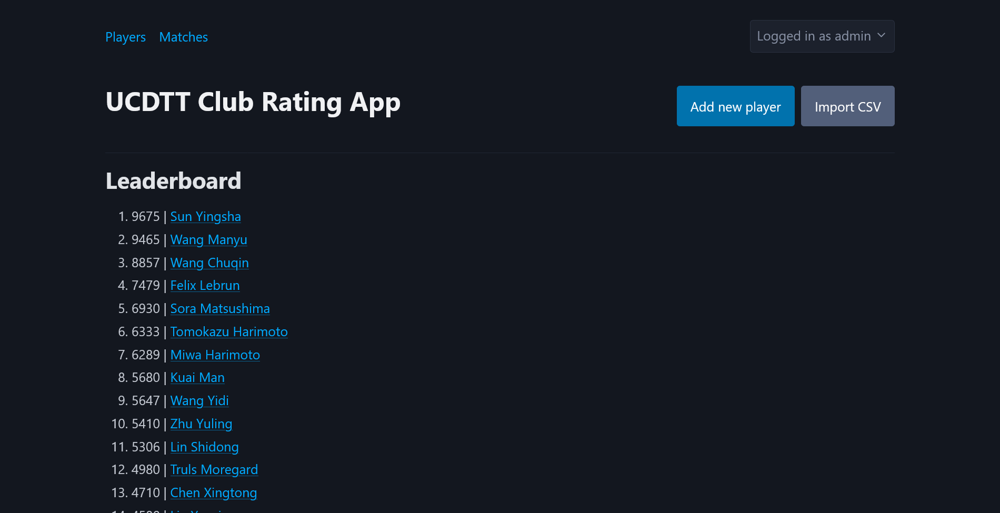

### Leaderboard (light)

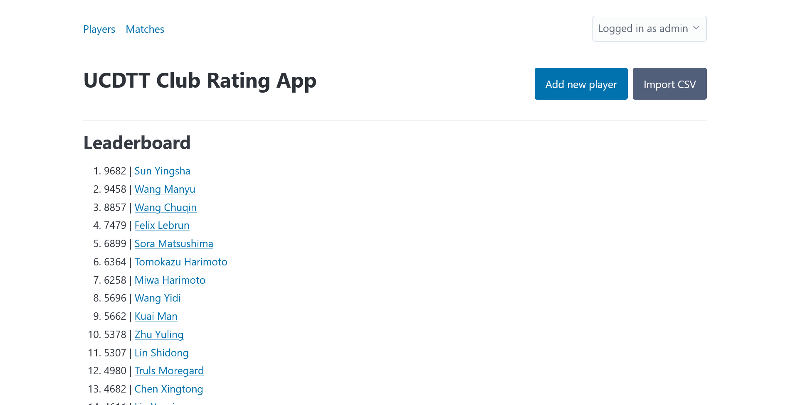

### Player details

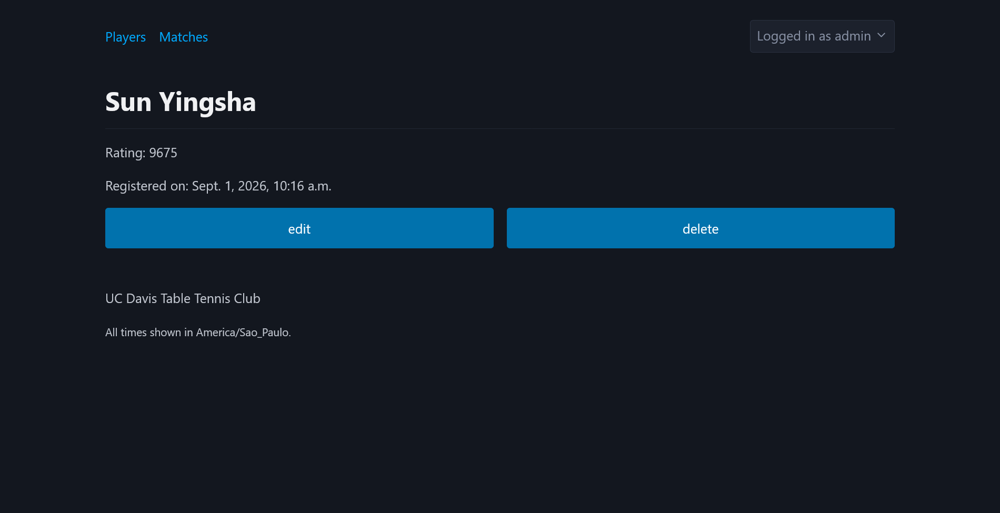

### Matches record

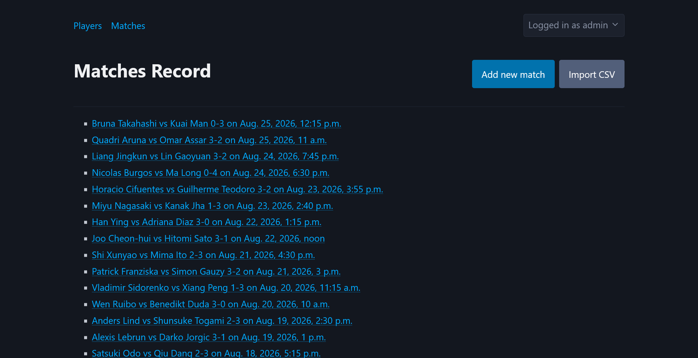

### Match details

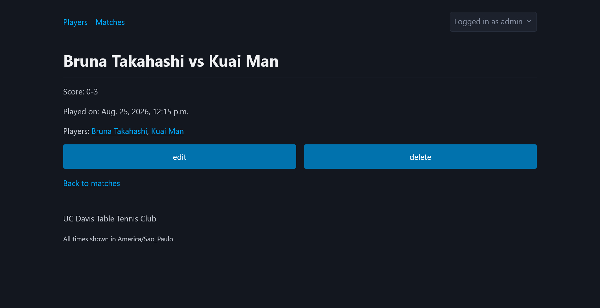

## Officer pages

Behind login. Officers record matches, manage the roster, and manage their own account.

### Add new player

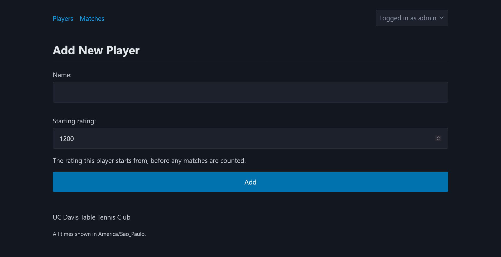

### Edit player

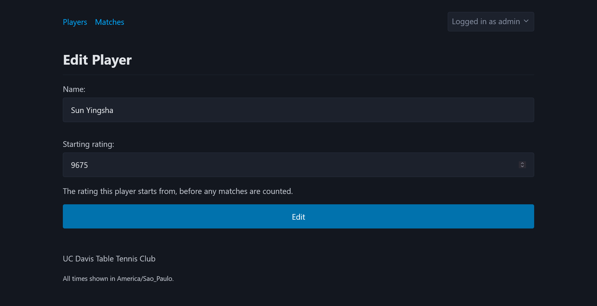

### Add new match

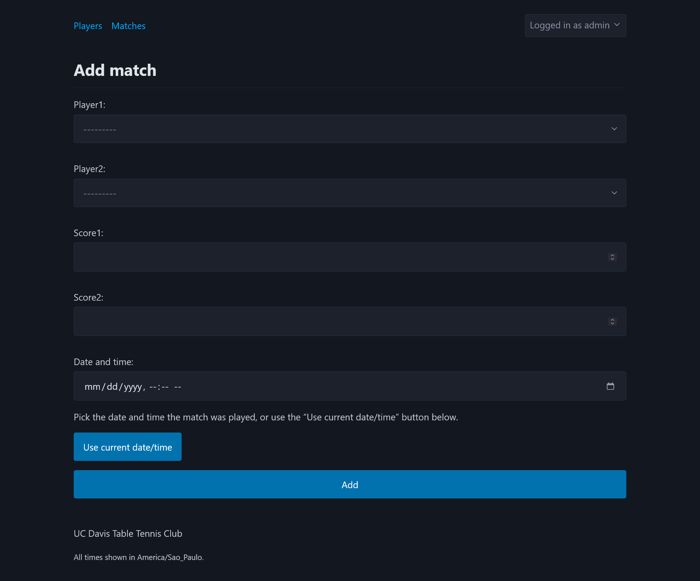

### Edit match

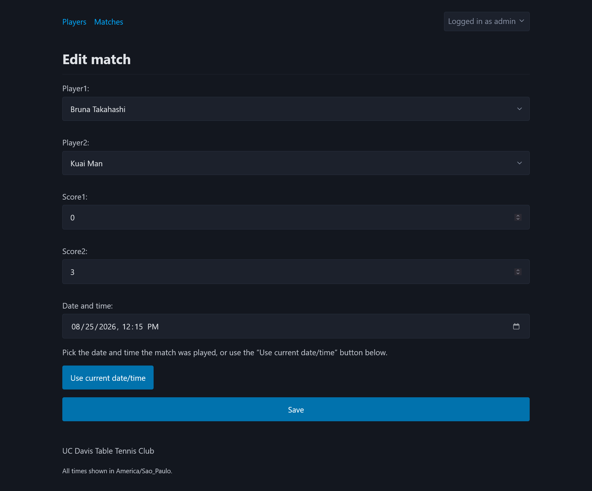

### Officer login

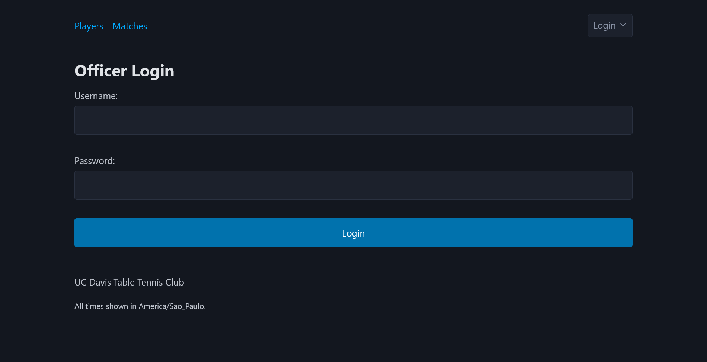

### Account

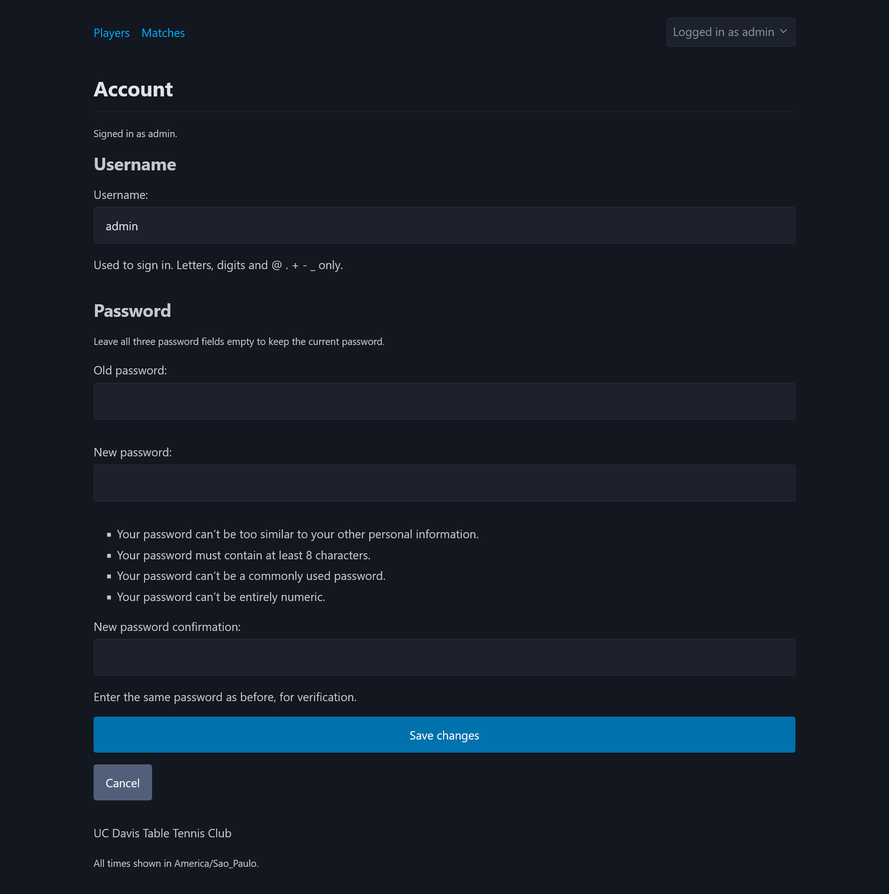

### New officer account

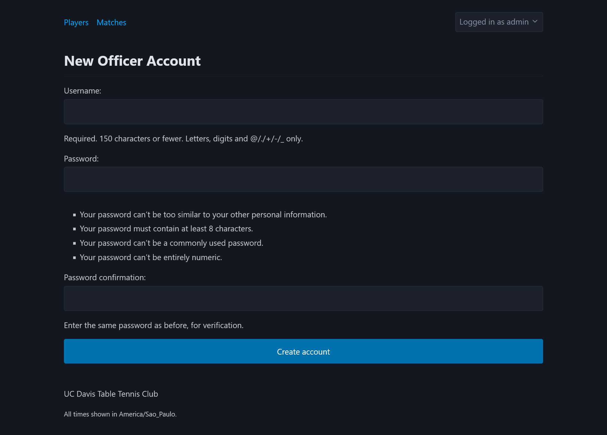

## CSV imports

Both importers take one upload, show a preview of what would change, and write nothing until the preview is confirmed.

### Import players

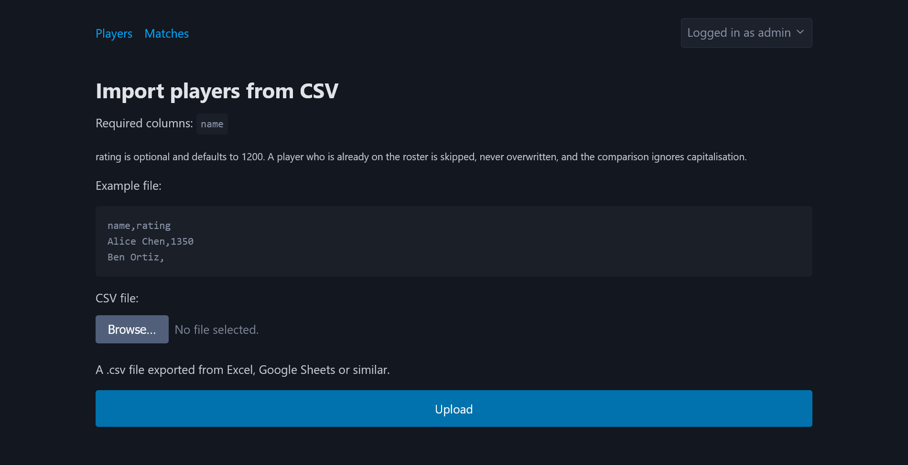

### Import players, preview and confirm

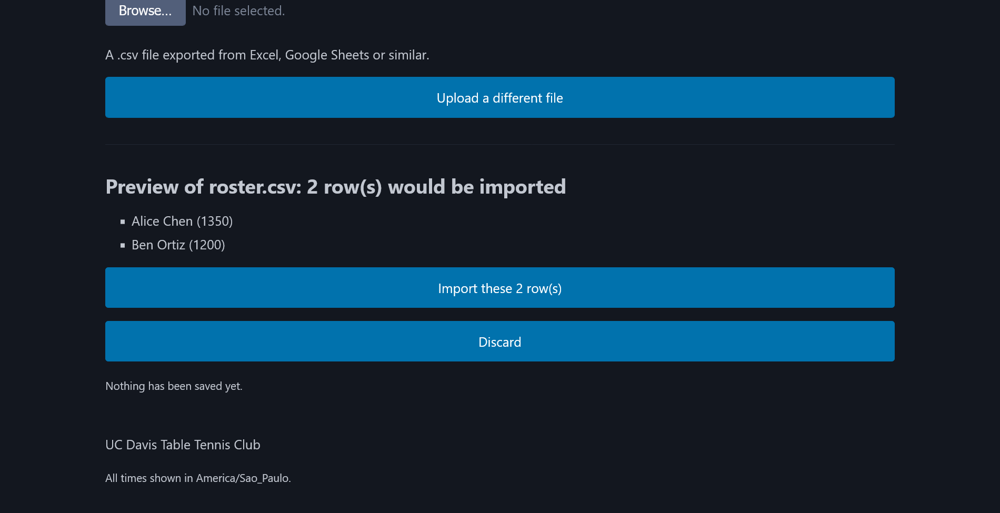

### Import matches

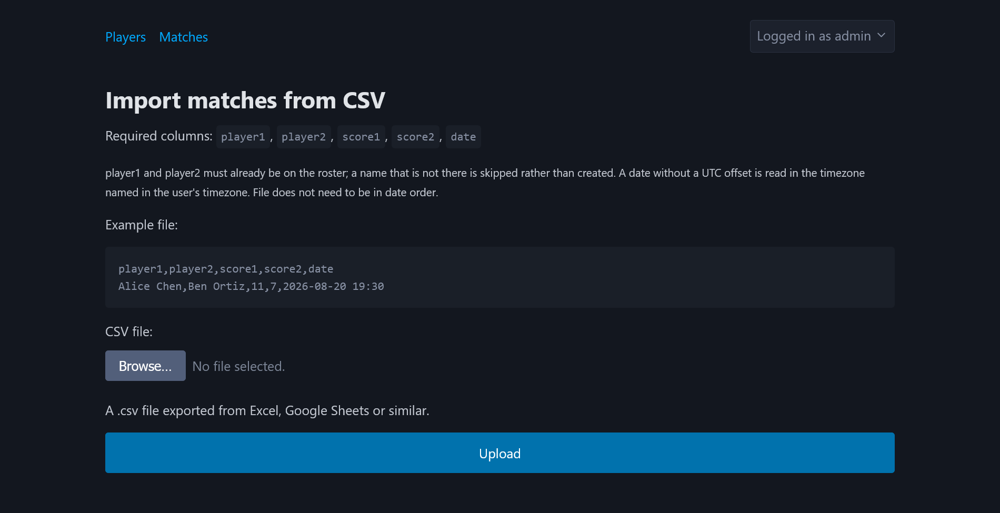

### Import matches, preview and confirm

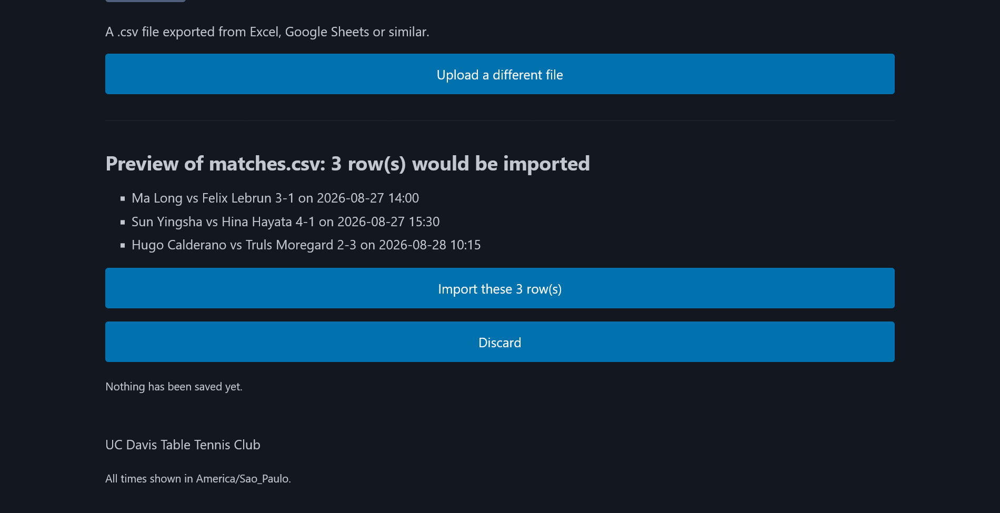

